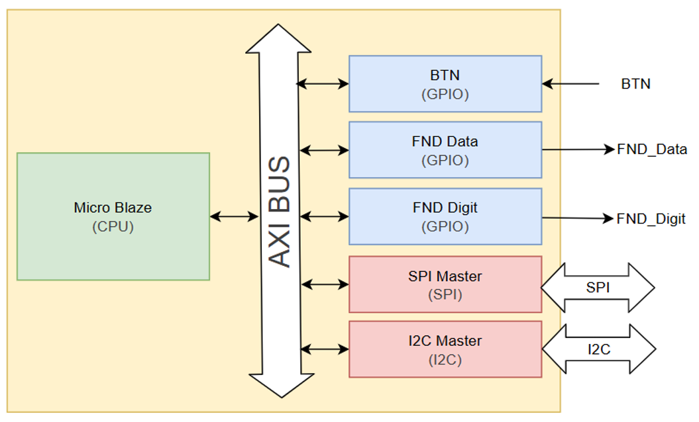
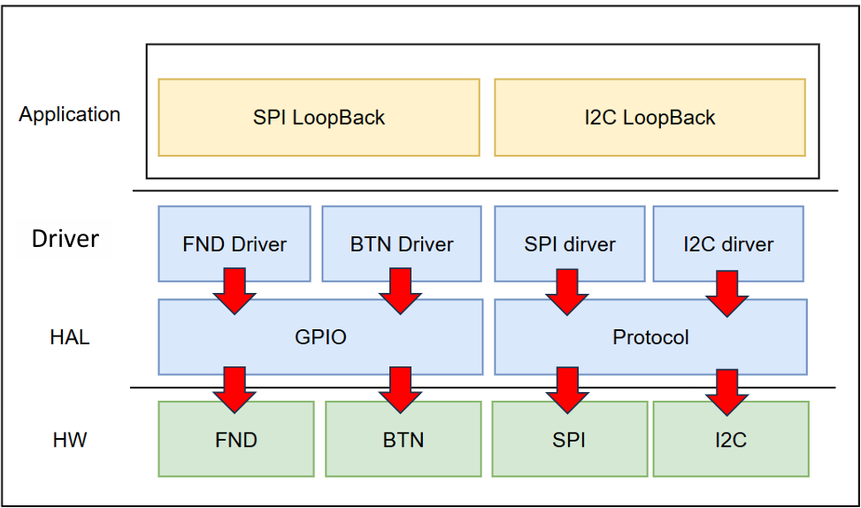
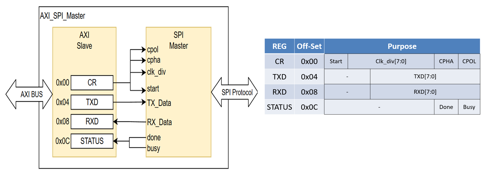
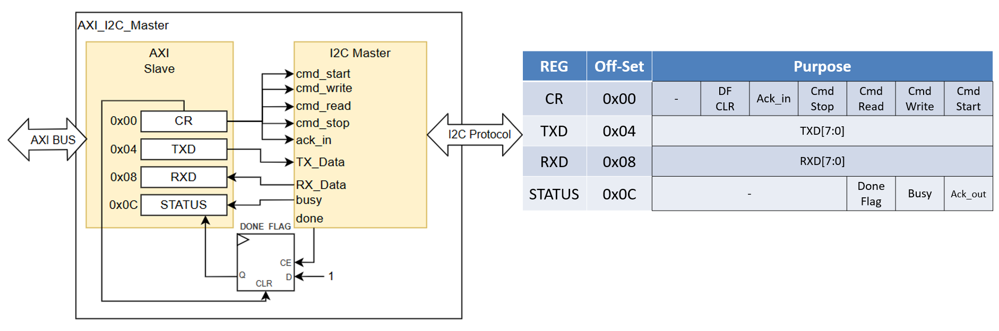
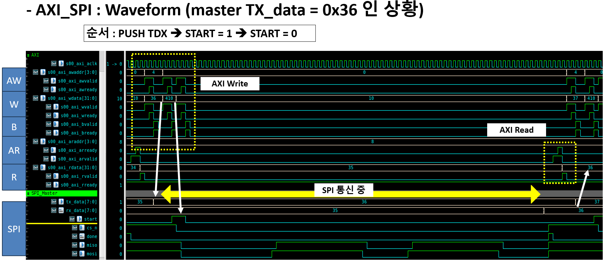
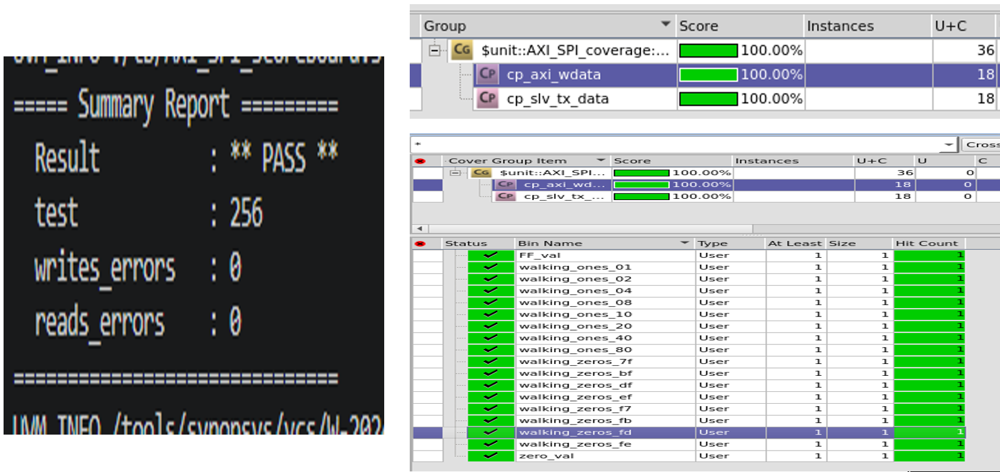
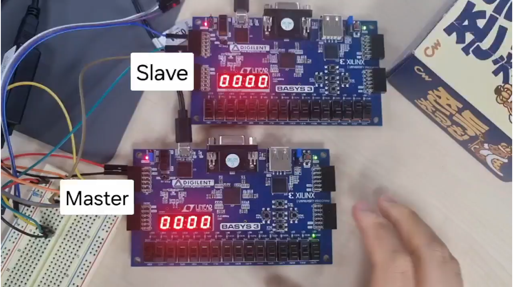

# AXI (SPI & I2C) SoC 설계 및 검증 프로젝트

## 📝 프로젝트 개요 (Overview)
이 프로젝트는 MicroBlaze 프로세서를 기반으로 AXI4 Lite 버스를 통해 SPI 및 I2C 마스터 모듈을 설계하고 제어하는 SoC(System on Chip)를 구현하는 것을 목표로 합니다. 설계된 하드웨어는 UVM(Universal Verification Methodology)을 통해 철저히 검증되었으며, 최종적으로 두 대의 Basys3 FPGA 보드를 연동하여 실제 하드웨어 통신망을 구축하고 동작을 확인하였습니다.

### 🎯 주요 목표
1. **MicroBlaze를 활용한 SPI, I2C 통신 설계**: 소프트웨어와 하드웨어의 협력(HW/SW Co-design)을 통한 시스템 구현.
2. **AXI4 Lite 프로토콜 적용**: AXI4 Lite 인터페이스를 설계하여 SPI 및 I2C 마스터 모듈의 송수신 제어.
3. **UVM 기반 하드웨어 검증**: AXI4 Lite 인터페이스와 모듈의 신뢰성을 확보하기 위해 UVM을 이용한 체계적인 검증 환경 구축.
4. **FPGA 실제 구현**: 2대의 Basys3 보드(Master/Slave)를 사용하여 실제 송수신 환경 구축 및 시각적 피드백(FND, 버튼) 제어.

### 🛠 개발 환경 및 사용 툴
- **SoC 설계 및 FPGA 합성**: Xilinx Vivado, Vitis IDE
- **검증 (UVM)**: Synopsys VCS, Verdi
- **타겟 보드**: Digilent Basys 3 (Artix-7 FPGA)
- **버스 프로토콜**: AMBA AXI4-Lite

---

## 🏗 시스템 아키텍처 (System Architecture)

### 1. SoC 하드웨어 블록도
MicroBlaze CPU를 중심으로 AXI BUS를 통해 여러 페리페럴(Peripheral)들이 연결되는 구조를 가집니다.
*   **제어 입력**: BTN (GPIO)
*   **상태 출력**: FND Data, FND Digit (GPIO)
*   **통신 모듈**: SPI Master, I2C Master

### 2. 메모리 맵 (Memory Mapping)
| Peripheral 모듈 | Base Address |
| :--- | :--- |
| **BTN (GPIO)** | `0x44A0_0000` |
| **FND Data (GPIO)** | `0x44A1_0000` |
| **FND Digit (GPIO)** | `0x44A2_0000` |
| **SPI Master** | `0x44A3_0000` |
| **I2C Master** | `0x44A4_0000` |
| **Main Memory** | `0x0000_0000` ~ `0x0001_FFFF` |

### 3. 소프트웨어 계층 구조 (Software Hierarchy)
시스템 제어를 위한 펌웨어(C 코드)는 유지보수성과 확장성을 위해 3계층 구조로 설계되었습니다.
- **Application Layer**: SPI LoopBack, I2C LoopBack 등 실제 통신 시나리오 비즈니스 로직
- **Driver Layer**: FND, BTN, SPI, I2C 등의 디바이스 특화 드라이버
- **HAL (Hardware Abstraction Layer)**: GPIO, Protocol 등 하드웨어 레지스터 접근 추상화

---

## 🧩 모듈 상세 설계 (Module Details)

### 1. AXI_GPIO 모듈
- 버튼 입력을 받아 시스템 제어 이벤트를 생성하고, SPI/I2C로 수신된 데이터를 7-Segment(FND)에 시각적으로 출력합니다.
- **Register Map**: `CR(0x00, Tri-state 버퍼 제어)`, `IDR(0x04, Input Data)`, `ODR(0x08, Output Data)`

### 2. AXI_SPI_Master 모듈
- SPI 프로토콜(CPOL, CPHA 모드 지원)을 AXI4 Lite 인터페이스로 래핑(Wrapping)하여 제어합니다.
- **Register Map**:
  - `CR (0x00)`: 통신 시작(Start), 클럭 분주(clk_div), CPHA, CPOL 설정
  - `TXD (0x04)`: 전송할 데이터 버퍼
  - `RXD (0x08)`: 수신된 데이터 버퍼
  - `STATUS (0x0C)`: Done, Busy 상태 모니터링

### 3. AXI_I2C_Master 모듈
- I2C 프로토콜을 제어하며, 하드웨어 상태 머신(IDLE ➔ START ➔ WAIT CMD ➔ DATA/ACK ➔ STOP)을 기반으로 동작합니다.
- 소프트웨어 폴링(Polling) 환경에서 찰나의 `Done` 신호를 놓치지 않도록 **Done Flag Logic**을 설계에 반영했습니다.
- **Register Map**:
  - `CR (0x00)`: DFCLR(Done Flag Clear), Ack_in, Cmd(Stop, Read, Write, Start)
  - `TXD (0x04)` / `RXD (0x08)`: 데이터 송수신
  - `STATUS (0x0C)`: DoneFlag, Busy, Ack_out

---

## 🔬 UVM 검증 (UVM Verification)

가장 복잡한 AXI_SPI 모듈이 정상 동작하는지 UVM 방법론을 통해 체계적으로 검증했습니다.

### 검증 포인트
- AXI4 Lite의 5개 채널(AW, W, B, AR, R) Ready/Valid 핸드셰이크 프로토콜 준수 여부
- AXI 신호를 통한 레지스터 제어로 SPI Master 통신이 시작되는지 확인
- 송/수신 데이터(`axi_wdata` ↔ `slv_rx_data`)의 무결성 비교

### 검증 환경 동작 원리
1. **Driver**: `CLK_div`, `MODE` 등을 세팅한 뒤, 0~255 난수 데이터를 `TXD`에 넣고 `Start` 트리거 발생. `Done` 대기 후 `RXD` 읽기.
2. **Monitor**: Write 채널(`AXI_WVALID && AXI_WREADY`)과 Read 채널의 타이밍을 감지하여 데이터를 Scoreboard로 전송.
3. **Scoreboard**: 마스터가 보낸 데이터와 슬레이브가 받은 데이터가 일치하는지 비교 검증(Pass/Fail 판정).

 

---

## 🚀 FPGA 실제 구현 (FPGA Implementation)

Vivado를 이용해 합성(Synthesis) 및 구현(Implementation)을 완료하고, 2대의 Basys3 보드를 사용하여 실제 환경 테스트를 진행했습니다.

- Master 보드의 버튼(BTN)을 눌러 통신 이벤트를 발생시킵니다.
- 설정된 SPI/I2C 프로토콜 핀(Jumper Wire)을 통해 Slave 보드로 데이터가 전송됩니다.
- 성공적으로 수신 및 루프백(Loopback)된 데이터가 각 보드의 FND 디스플레이에 출력되는 것을 최종 확인했습니다.

---

## 🛠 트러블슈팅 (Troubleshooting)

### SW Done Check 타이밍 이슈
- **문제 상황**: 소프트웨어(C 코드)에서 I2C 통신을 제어할 때, 하드웨어 모듈이 통신 완료 시 보내는 `Done` 신호가 **단 1 Clock Tick** 동안만 발생했습니다. 이로 인해 소프트웨어가 Polling 방식으로 `Done` 신호를 감지하기 전에 신호가 사라져 다음 커맨드를 전달하지 못하는 문제가 발생했습니다.
- **해결 방법**: 하드웨어(Verilog) 설계 레벨에서 `Done Flag Logic`을 추가했습니다. 1-Tick의 Done 신호가 들어오면 D-Flip Flop을 이용해 `Done Flag`를 High 상태로 유지시킵니다. 소프트웨어는 이 Flag를 확인하여 다음 동작을 수행하고, 처리가 끝나면 `DFCLR (Done Flag Clear)` 레지스터에 접근해 하드웨어 플래그를 초기화하는 방식으로 완벽한 HW-SW 동기화를 이뤄냈습니다.

---

## 💡 회고 및 느낀 점 (Conclusion)

과거 순수 하드웨어(RTL) 설계 프로젝트를 진행하며 수많은 트러블슈팅으로 디버깅 감각을 키워왔지만, 이번 SoC 설계는 **하드웨어와 소프트웨어를 병행(HW/SW Co-Design)**해야 한다는 점에서 새로운 차원의 문제들을 경험하게 해주었습니다.

문제 원인 분석에 많은 시간을 할애하며 깨달은 가장 큰 수확은 **소프트웨어의 계층적 구조(Architecture) 설계의 중요성**이었습니다. 디바이스 드라이버와 HAL(Hardware Abstraction Layer)을 나누어 구조화하지 않았다면, 복잡한 시스템의 디버깅 과정이 훨씬 난해하고 고통스러웠을 것입니다. 

이번 프로젝트를 계기로 체계적인 소프트웨어 구조가 하드웨어 제어에 가져다주는 안정성과 유지보수성의 장점을 깊이 이해하게 되었으며, 향후 시스템 설계 시 이러한 구조적 접근법을 적극 활용할 계획입니다.

---
*발표자: 이준형*